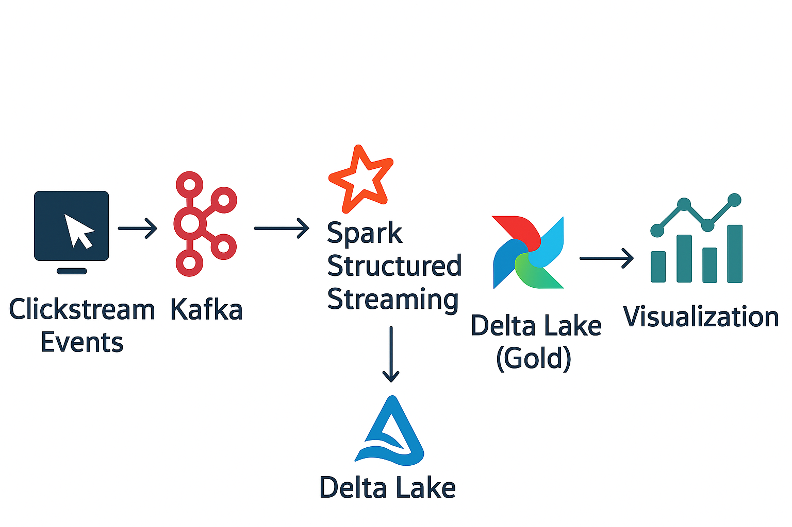
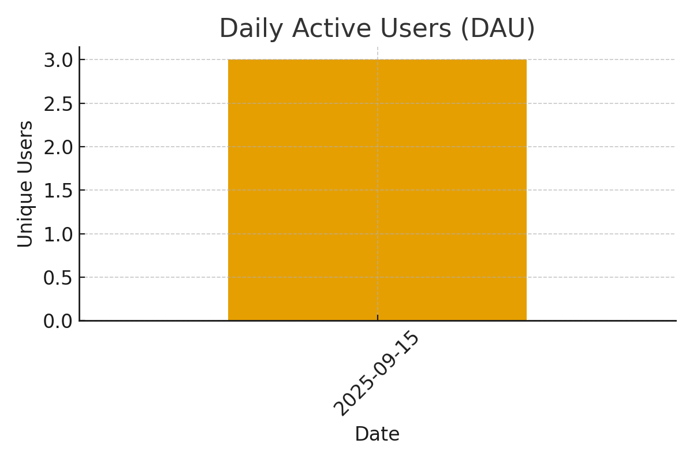

# 🚀 Real-Time Clickstream Data Pipeline (End-to-End Streaming Project)

🚀 End-to-end real-time clickstream analytics pipeline using Kafka, Spark (Delta Lake), Airflow, DuckDB, and Power BI. Cloud-ready design with Bronze-Silver-Gold architecture, easily portable to Azure (ADLS, Databricks, Synapse).

---

## 🏗️ Architecture

**Flow:**  
`Clickstream Simulator → Kafka → Spark Structured Streaming → Delta Lake (bronze/silver/gold) → Airflow (batch orchestration) → DuckDB (Synapse simulation) → Power BI`



---

## ⚡ Tech Stack

- **Storage:** Local filesystem (simulating Azure Data Lake Gen2 with `bronze/silver/gold` zones)
- **Streaming:** Apache Kafka (Docker)
- **Processing:** Apache Spark (PySpark + Delta Lake)
- **Orchestration:** Apache Airflow (optional, via pip or Docker)
- **Warehouse:** DuckDB (simulating Azure Synapse)
- **Visualization:** Power BI Desktop (free) or Metabase (open-source)

---

## 📂 Project Structure

```
clickstream-pipeline/
├─ docker/
│  └─ docker-compose-kafka.yml      # Kafka + Zookeeper setup
├─ airflow/
│  └─ dags/
│     └─ etl_dag.py                 # Airflow DAG (optional)
├─ src/
│  ├─ data_generator.py             # Kafka producer (simulated clickstream)
│  ├─ spark_streaming.py            # Streaming ingestion → Delta (bronze)
│  ├─ batch_transform.py            # Batch ETL (bronze → silver → gold)
│  └─ export_to_duckdb.py           # Export gold data to DuckDB/CSV
├─ data_lake/                       # Local "ADLS" (bronze/silver/gold zones)
└─ README.md
```

---

## 🛠️ Setup Instructions

### 1. Clone Repo & Setup Environment
```bash
git clone https://github.com/yourusername/clickstream-pipeline.git
cd clickstream-pipeline
python -m venv .venv
source .venv/bin/activate       # Windows: .venv\Scripts\activate
pip install --upgrade pip
pip install kafka-python pyspark delta-spark duckdb pandas
```

⚠️ Prerequisites:
- Install **Docker & Docker Compose**
- Install **Java 11 JDK** (required by Spark)
- (Optional) Install **Airflow** for orchestration

---

### 2. Start Kafka via Docker
```bash
cd docker
docker-compose -f docker-compose-kafka.yml up -d
```

Create topic:
```bash
docker exec -it $(docker ps --filter "ancestor=bitnami/kafka" -q) \
  /opt/bitnami/kafka/bin/kafka-topics.sh \
  --create --topic clickstream-events \
  --bootstrap-server localhost:9092 --partitions 3 --replication-factor 1
```

---

### 3. Run Clickstream Data Generator
```bash
python src/data_generator.py
```
➡️ Continuously sends synthetic user clickstream events to Kafka.

---

### 4. Start Spark Structured Streaming Job
```bash
python src/spark_streaming.py
```
➡️ Consumes Kafka events → stores raw data in **Delta Lake (bronze)** under `./data_lake/bronze`.

---

### 5. Run Batch ETL Job (Bronze → Silver → Gold)
```bash
python src/batch_transform.py
```
➡️ Cleans and aggregates events, creating **session summary tables** in gold zone.

---

### 6. Export Gold Data to DuckDB / CSV
```bash
python src/export_to_duckdb.py
```
➡️ Loads curated data into DuckDB and exports sample CSV (`session_sample.csv`).

---

### 7. Visualization
- **Power BI Desktop (Windows):**
  - Open `session_sample.csv`
  - Build dashboards: DAU, page views, session duration, funnel conversion
- **Alternative (cross-platform):**
  - Run Metabase via Docker and connect to DuckDB/CSV

---

## 📊 Example Dashboards

### Daily Active Users


### Average Session Duration per User


### Distribution of Events per Session


---

## 🚀 Run End-to-End (Quick Recap)

```bash
# Terminal 1 - start Kafka
docker-compose -f docker/docker-compose-kafka.yml up -d

# Terminal 2 - run Spark streaming (keep running)
python src/spark_streaming.py

# Terminal 3 - run clickstream generator
python src/data_generator.py

# Terminal 4 - batch ETL + export
python src/batch_transform.py
python src/export_to_duckdb.py
```

Then open CSV/Parquet in Power BI or Metabase to build dashboards 🎉

---

## 🌐 Next Steps (Cloud Migration)

- Replace local `data_lake/` → **Azure Data Lake Gen2 (ADLS Gen2)**
- Replace DuckDB → **Azure Synapse Analytics**
- Deploy Kafka & Airflow → **Azure Kubernetes Service (AKS)**
- Run Spark jobs → **Azure Databricks**

---
